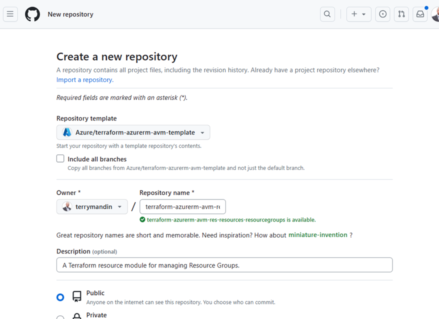
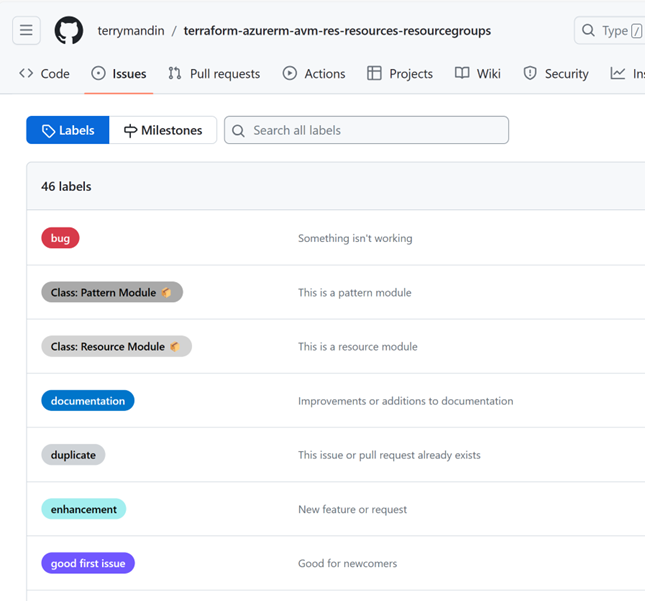

### Part 2 - Create a Repository from AVM Template

#### Reference
* [Terraform Contribution Guide | Azure Verified Modules](https://azure.github.io/Azure-Verified-Modules/contributing/terraform/#template-repository)
* [ID: SNFR11 - Category: Contribution/Support - Issues Response Times](https://azure.github.io/Azure-Verified-Modules/specs/shared/#id-snfr11---category-contributionsupport---issues-response-times)

Steps:

* Go to: [Azure/terraform-azurerm-avm-template: Template repo for Azure Verified Modules using Terraform (github.com)](https://github.com/Azure/terraform-azurerm-avm-template)
* Click “Use this template”:


* Fill in the following

| Field | Value |
|--|--|
| Include all branches | Uncheck |
| Owner | For the lab choose your personal org. When creating a real AVM choose “Azure” |
| Repository name | terraform-azurerm-avm-res-resources-resourcegroups <br> See: [Module Publishing](https://azure.github.io/Azure-Verified-Modules/contributing/terraform/#module-publishing) |
| Description | A Terraform resource module for managing Resource Groups. |



* This lab creates a repository in your organization.  When you create an AVM in the Azure repository you will need to follow the [1es](https://dev.azure.com/CSUSolEng/Azure%20Verified%20Modules/_wiki/wikis/AVM%20Internal%20Wiki/274/1es) process.  You will receive an email and will need to enter information related to our organization.


### Create Labels

#### Reference
* [ID: SNFR23 - Category: Contribution/Support - GitHub Repo Labels](https://azure.github.io/Azure-Verified-Modules/specs/shared/#id-snfr23---category-contributionsupport---github-repo-labels)


#### Steps:

* Run ```pwsh``` from a command line and enter the following
* Download [Set-AvmGitHubLabels.ps1](https://azure.github.io/Azure-Verified-Modules/scripts/Set-AvmGitHubLabels.ps1)
```
gh auth login
gh repo list
.\Set-AvmGitHubLabels.ps1 -RepositoryName "<org>/<repo>" -CreateCsvLabelExports $false -NoUserPrompts $true
```
#### View Labels:

* Go to your GitHub Repo
* Click on "Issues"
* Click on "Labels"



### Assign GitHub Teams

Assign the appropriate GitHub teams to the repo.  

<b>As these teams need to be configured in the ```Azure``` GitHub organization we will not do them in this lab.</b>

#### Reference

* [ID: SNFR20 - Category: Contribution/Support - GitHub Teams Only](https://azure.github.io/Azure-Verified-Modules/specs/shared/#id-snfr20---category-contributionsupport---github-teams-only)
* [ID: SNFR9 - Category: Contribution/Support - AVM & PG Teams GitHub Repo Permissions](https://azure.github.io/Azure-Verified-Modules/specs/shared/#id-snfr9---category-contributionsupport---avm--pg-teams-github-repo-permissions)

[Prev](1_Proposal.md) [Next](3_Coding.md)