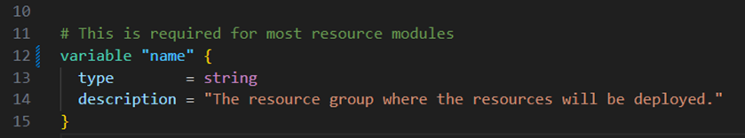
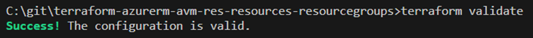
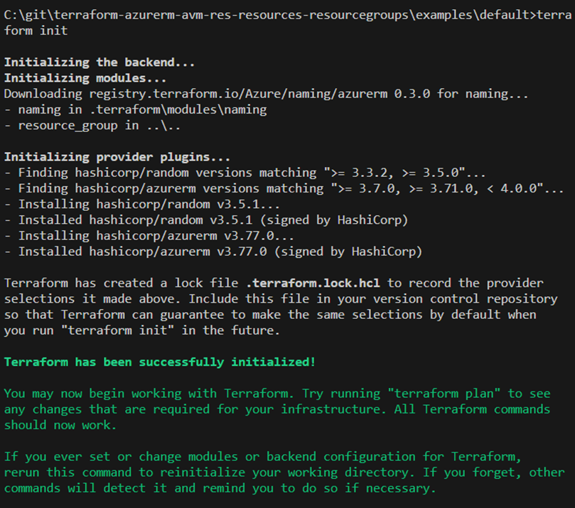
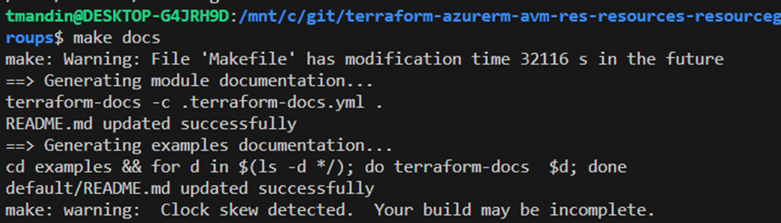

### Part 3 - Coding

### Clone from GitHub repository

* Clone from the new repository and open in VS Code
```
git clone https://github.com/<org name>/terraform-azurerm-avm-res-resources-resourcegroups.git
cd terraform-azurerm-avm-res-resources-resourcegroups
code .
```
* Create a branch
* Review the Terraform files created by the template:
  * terraform.tf
  * main.tf
  * main.telemetry.tf
  * variables.tf
  * locals.tf
  * outputs.tf
  * examples\default
    * main.tf

### Initialize

* Open a Terminal in VS Code
* Enter:
```
terrafom init
```


### Add Variables

#### References

* [Interfaces | Azure Verified Modules](https://azure.github.io/Azure-Verified-Modules/specs/shared/interfaces/)
* [ID: TFNFR4 - Category: Composition - Code Styling - lower snake_casing](https://azure.github.io/Azure-Verified-Modules/specs/terraform/#id-tfnfr4---category-composition---code-styling---lower-snake_casing)
* [ID: TFNFR1 - Category: Documentation - Descriptions](https://azure.github.io/Azure-Verified-Modules/specs/terraform/#id-tfnfr1---category-documentation---descriptions)
* [ID: SNFR25 - Category: Composition - Resource Naming](https://azure.github.io/Azure-Verified-Modules/specs/shared/#id-snfr25---category-composition---resource-naming)

#### Steps

*	Open variables.tf
*	Rename the “resource_group_name” variable to “name’.  Most often a resource will need an associated resource group, but since our AVM is a resource group we will just call the variable “name”.



* Add a location variable for the region where the resource group will be deployed.

```
variable "location" { 
  type = string
  description = "The Azure Region in which all resources in this example should be created."
  validation {
    condition = contains(["eastus", "eastus2", "westus", "westus2"], var.location)
    error_message = "The location must be eastus, eastus2, westus, or westus2."
  }
}
```
*	Open main.telemetry.tf
*	On line 11, change to point to the variable “name”

```
resource_group_name = var.name
```
* Open a terminal
* Login to Azure

```
az login
```
*	Ensure the correct subscription is defaulted.
```
az account list -o table
az account set -s <subscription_id>
```
* Validate the code
```
terraform validate
```


### Add the Resource Group Terraform code

#### References

* [azurerm_resource_group](https://registry.terraform.io/providers/hashicorp/azurerm/latest/docs/resources/resource_group)

#### Steps

* Open main.tf
* Enter the following:
```
resource "azurerm_resource_group" "this" {
    name     = var.name
    location = var.location 
}
```
### Add Outputs

#### Reference

* [ID: TFFR2 - Category: Outputs - Additional Terraform Outputs](https://azure.github.io/Azure-Verified-Modules/specs/terraform/#id-tffr2---category-outputs---additional-terraform-outputs)

#### Steps

* Open outputs.tf
* Add outputs for the resource id and resource group name:

```
output "resource" {
  value = azurerm_resource_group.this.id
}

output "resource_group_name" {
  value = azurerm_resource_group.this.name
```

### Validate the code

```
terraform validate
```


### Create Sample Code

The code is now ready to deploy the resource group.  Let’s create some sample code to call our module.

*	Open examples\default\main.tf
*	Set the enable_telementry “default” flag on line 13 to false.  We will not be sending telemetry in the lab.

```
default     = false
```

*	Comment lines 28 to 31.  Usually, you would leave the resource group in, but since we are creating a resource AVM for resource groups, the code is not needed.

```
#resource "azurerm_resource_group" "this" {
#  name     = module.naming.resource_group.name_unique
#  location = "MYLOCATION"
#}
```

*	Update lines 34 to 39 to call your module.  Notice that we will use a naming module to give a unique name to the resource group.

```
# This is the module call
module "terraform-azurerm-avm-res-resources-resourcegroups" { 
  source = "../../"
  enable_telemetry = var.enable_telemetry 
  name = module.naming.resource_group.name_unique
  location = "eastus"
}
```
* Add outputs to see the resource group name and id to the bottom of the file.  Note that they are outputting the outputs from our module.
```
output "resource_group_name" {
  value = module.terraform-azurerm-avm-res-resources-resourcegroups.resource_group_name
}

output "resource_group_id" {
  value = module.terraform-azurerm-avm-res-resources-resourcegroups.resource
}
```

Deploy the Resource Group AVM

*	The sample code also needs to be initialized and deployed
```
cd examples\default
terraform init
```



* Call Terraform plan and apply.  Enter “yes” when prompted.  The “+” sign shows resources to be added.  Note Terraform will make these changes: “3 to add, 0 to change, 0 to destroy”.

```
terraform plan
```


*	Deploy the resource group.  Enter “yes” when prompted.  Note that 3 resources were created.  Terraform also outputs the resource group name and id.  

```
terraform apply
```


* Enter the following from the command line to see your resource group:

```
az group list -o table
```

### Add Locking and Tags variables

*	Add the following variable to your module’s variables.tf

```
variable "tags" {
  type        = map(any)
  description = "Map of tags to assign to the resources."
  default     = null
}

variable "lock" {
  type = object({
    name = optional(string, null)
    kind = optional(string, "None")
  })
  description = "The lock level to apply to the resources in this pattern. Default is `None`. Possible values are `None`, `CanNotDelete`, and `ReadOnly`."
  default     = {}
  nullable    = false
  validation {
    condition     = contains(["CanNotDelete", "ReadOnly", "None"], var.lock.kind)
    error_message = "The lock level must be one of: 'None', 'CanNotDelete', or 'ReadOnly'."
  }
}
```

* Update your module’s main.tf to add locking as follows.  Note that we added tags to the resource group.

```
resource "azurerm_resource_group" "this" {
    name     = var.name
    location = var.location
    tags     = var. tags 
}

resource "azurerm_management_lock" "this" {
  count      = var.lock.kind != "None" ? 1 : 0
  name       = coalesce(var.lock.name, "lock-${var.name}")
  scope      = azurerm_resource_group.this.id
  lock_level = var.lock.kind
}
```

* Update your example’s main.tf module call to add tags.  Hit <cntrl><space> to have intellisense show possible variable names.

```
module "terraform-azurerm-avm-res-resources-resourcegroups" { 
  source = "../../"
  enable_telemetry = var.enable_telemetry 
  name = module.naming.resource_group.name_unique
  location = "eastus"
  tags = {
    environment = "dev"
    costcenter  = "it"
  }
}
```

* Plan and apply.  Ensure you are in the examples\default directory.  Enter “yes” when prompted in the apply.

```
terraform plan
```


```
terraform apply
```


* View the tags

```
az tag list --resource-id <resource-group-id>
```


### Generating documentation

#### References

* [ID: TFNFR2 - Category: Documentation - Module Documentation Generation](https://azure.github.io/Azure-Verified-Modules/specs/terraform/#id-tfnfr2---category-documentation---module-documentation-generation)

#### Steps

* Change back to the root directory
```
cd ..\..
```
* If you have “make” installed in wsl you can run the following:
```
make docs
```


* If make is not installed, you can call terraform-docs directly:

```
terraform-docs -c .terraform-docs.yml .
```


* Look at the README.md file to see that it has been updated.

### Homework: BONUS POINTS!

Looks like you finished early.  WELL DONE!! 

Here are some additional items you can try:

* Enable Locking 
  * Update the main.tf in the example app to enable locking.
  * Call “terraform apply”
  * Verify that a lock has been applied to the resource group.
* Disable Locking
  * Update the main.tf in the example app to remove locking
  *	Call “terraform apply”
  *	Verify that the lock has been removed.
* Resource groups also have a “managed by” property.  Add this variable and configure it from the example code.
  * Hint: azurerm_resource_group | Resources | hashicorp/azurerm | Terraform | Terraform Registry
* If a resource supports role assignments, they are a required interface for an AVM.  Try adding role assignments to your AVM. 
  * See Interfaces | Azure Verified Modules | Role Assignments.

[Prev](2_RepoSetup.md) [Next](4_CleanUp.md)