# Introduction to using Azure Verified Modules for Terraform

This is a lab based sample that demonstrates how to use the Azure Verified Modules for Terraform. The repository contains the full working solution, but you should follow the steps in the lab to understand how it fits together.

## Content

| File/folder | Description |
|-------------|-------------|
| `labs` | The files for the lab. |
| `.gitignore` | Define what to ignore at commit time. |
| `CHANGELOG.md` | List of changes to the sample. |
| `CONTRIBUTING.md` | Guidelines for contributing to the sample. |
| `README.md` | This README file. |
| `LICENSE.md` | The license for the sample. |

## Features

This lab walks through the following steps in AVM cration
* Module proposal
* GitHub setup
* Coding steps
* AVM submission

## Getting Started

### Prerequisites

* HashiCorp Terraform CLI Version 1.7 or higher: [Download](https://www.terraform.io/downloads)
* Git: [Download](https://git-scm.com/downloads)
* Visual Studio Code: [Download](https://code.visualstudio.com/)
  * Azure Terraform Extension for Visual Studio Code: [Install](https://marketplace.visualstudio.com/items?itemName=ms-azuretools.vscode-azureterraform)
  * HashiCorp Terraform Extension for Visual Studio Code: [Install](https://marketplace.visualstudio.com/items?itemName=HashiCorp.terraform)
* Azure CLI: [Download](https://learn.microsoft.com/en-us/cli/azure/install-azure-cli-windows?tabs=azure-cli#install-or-update)
* An Azure Subscription: [Free Account](https://azure.microsoft.com/en-gb/free/search/)

### Quickstart

The instructions for this sample are in the form of a Lab. Follow along with them to get up and running.

## Demo / Lab

### Part 0 - Propose module

#### Reference
* [ID: SNFR11 - Category: Contribution/Support - Issues Response Times](https://azure.github.io/Azure-Verified-Modules/specs/shared/#id-snfr11---category-contributionsupport---issues-response-times)

Use the following fields to fill in the form

| Field | Value |
|--|--|
| Name: | [Module Proposal]: Resource Group Resource Module|
| I have checked for previous/existing GitHub issues/module proposals. | Check |
| I have checked for that this module doesn't already exist in the module indexes; or I'm proposing the module to be migrated from CARML/TFVM. | Check |
| Bicep or Terraform | Terraform |
| Module Classification | Resource Module |
| Repository Name | terraform-azurerm-avm-res-resources-resourcegroups |
| Module Details | A Terraform resource module for managing Resource Groups. |
| Do you want to be the owner of this module?   | Yes <br> See: [SNFR11 - Issues Response Times](https://azure.github.io/Azure-Verified-Modules/specs/shared/#id-snfr11---category-contributionsupport---issues-response-times) |
| Module Owner's GitHub Username (handle) | Github username |
| (Optional) Secondary Module Owner's GitHub Username (handle) | Github username <br> NOTE: By choosing to be an owner you are agreeing to AVM SLAs.  For this reason, it is recommended that you have at least secondary owner. |
| Submit new issue | DO NOT CLICK |

### Part 1 - Wait for approval

* Expect some back and forth with the AVM Team
* Don't start before you get approval

### Part 2 - Create a Repository from AVM Template

#### Reference
* [Terraform Contribution Guide | Azure Verified Modules](https://azure.github.io/Azure-Verified-Modules/contributing/terraform/#template-repository)
* [ID: SNFR11 - Category: Contribution/Support - Issues Response Times](https://azure.github.io/Azure-Verified-Modules/specs/shared/#id-snfr11---category-contributionsupport---issues-response-times)

Steps:

* Go to: [Azure/terraform-azurerm-avm-template: Template repo for Azure Verified Modules using Terraform (github.com)](https://github.com/Azure/terraform-azurerm-avm-template)
* Click “Use this template”:

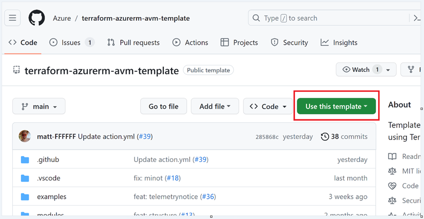

* Fill in the following

| Field | Value |
|--|--|
| Include all branches | Uncheck |
| Owner | For the lab choose your personal org. When creating a real AVM choose “Azure” |
| Repository name | terraform-azurerm-avm-res-resources-resourcegroups <br> See: [Module Publishing](https://azure.github.io/Azure-Verified-Modules/contributing/terraform/#module-publishing) |
| Description | A Terraform resource module for managing Resource Groups. |

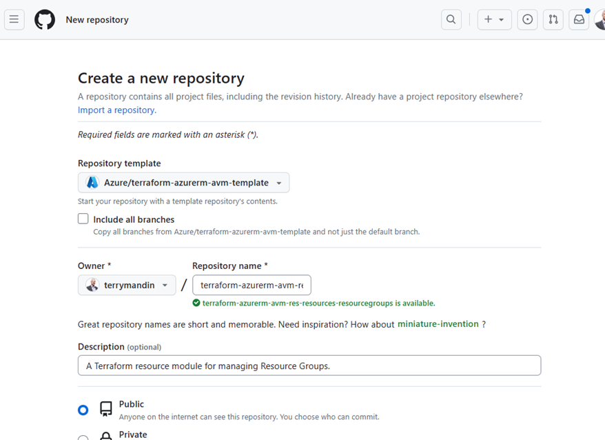

* This lab creates a repository in your organization.  When you create an AVM in the Azure repository you will need to follow the [1es](https://dev.azure.com/CSUSolEng/Azure%20Verified%20Modules/_wiki/wikis/AVM%20Internal%20Wiki/274/1es) process.  You will receive an email and will need to enter information related to our organization.


### Create Labels

#### Reference
* [ID: SNFR23 - Category: Contribution/Support - GitHub Repo Labels](https://azure.github.io/Azure-Verified-Modules/specs/shared/#id-snfr23---category-contributionsupport---github-repo-labels)


#### Steps:

* Run ```pwsh``` from a command line and enter the following
* Download [Set-AvmGitHubLabels.ps1](https://azure.github.io/Azure-Verified-Modules/scripts/Set-AvmGitHubLabels.ps1)
```
gh auth login
gh repo list
.\Set-AvmGitHubLabels.ps1 -RepositoryName "<org>/<repo>" -CreateCsvLabelExports $false -NoUserPrompts $true
```
#### View Labels:

* Go to your GitHub Repo
* Click on "Issues"
* Click on "Labels"

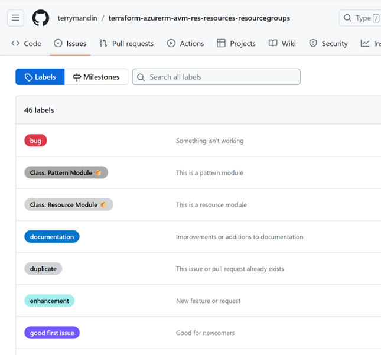

### Assign GitHub Teams

Assign the appropriate GitHub teams to the repo.  

<b>As these teams need to be configured in the ```Azure``` GitHub organization we will not do them in this lab.</b>

#### Reference

* [ID: SNFR20 - Category: Contribution/Support - GitHub Teams Only](https://azure.github.io/Azure-Verified-Modules/specs/shared/#id-snfr20---category-contributionsupport---github-teams-only)
* [ID: SNFR9 - Category: Contribution/Support - AVM & PG Teams GitHub Repo Permissions](https://azure.github.io/Azure-Verified-Modules/specs/shared/#id-snfr9---category-contributionsupport---avm--pg-teams-github-repo-permissions)

### Clone from GitHub repository

* Clone from the new repository and open in VS Code
```
git clone https://github.com/<org name>/terraform-azurerm-avm-res-resources-resourcegroups.git
cd terraform-azurerm-avm-res-resources-resourcegroups
code .
```
* Create a branch
* Review the Terraform files created by the template:
  * terraform.tf
  * main.tf
  * main.telemetry.tf
  * variables.tf
  * locals.tf
  * outputs.tf
  * examples\default
    * main.tf

### Initialize

* Open a Terminal in VS Code
* Enter:
```
terrafom init
```
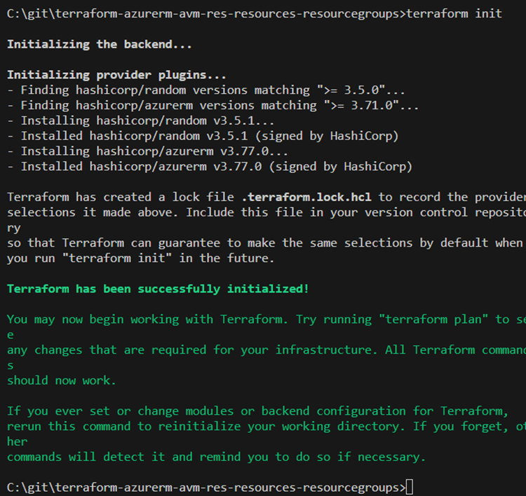

### Add Variables

#### References

* [Interfaces | Azure Verified Modules](https://azure.github.io/Azure-Verified-Modules/specs/shared/interfaces/)
* [ID: TFNFR4 - Category: Composition - Code Styling - lower snake_casing](https://azure.github.io/Azure-Verified-Modules/specs/terraform/#id-tfnfr4---category-composition---code-styling---lower-snake_casing)
* [ID: TFNFR1 - Category: Documentation - Descriptions](https://azure.github.io/Azure-Verified-Modules/specs/terraform/#id-tfnfr1---category-documentation---descriptions)
* [ID: SNFR25 - Category: Composition - Resource Naming](https://azure.github.io/Azure-Verified-Modules/specs/shared/#id-snfr25---category-composition---resource-naming)

#### Steps

*	Open variables.tf
*	Rename the “resource_group_name” variable to “name’.  Most often a resource will need an associated resource group, but since our AVM is a resource group we will just call the variable “name”.

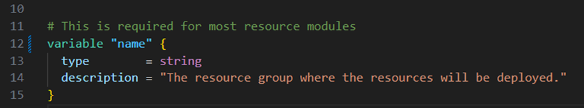

* Add a location variable for the region where the resource group will be deployed.

```
variable "location" { 
  type = string
  description = "The Azure Region in which all resources in this example should be created."
  validation {
    condition = contains(["eastus", "eastus2", "westus", "westus2"], var.location)
    error_message = "The location must be eastus, eastus2, westus, or westus2."
  }
}
```
*	Open main.telemetry.tf
*	On line 11, change to point to the variable “name”

```
resource_group_name = var.name
```
* Open a terminal
* Login to Azure

```
az login
```
*	Ensure the correct subscription is defaulted.
```
az account list -o table
az account set -s <subscription_id>
```
* Validate the code
```
terraform validate
```
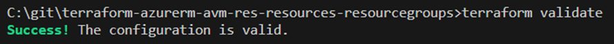

### Add the Resource Group Terraform code

#### References

* [azurerm_resource_group](https://registry.terraform.io/providers/hashicorp/azurerm/latest/docs/resources/resource_group)

#### Steps

* Open main.tf
* Enter the following:
```
resource "azurerm_resource_group" "this" {
    name     = var.name
    location = var.location 
}
```
### Add Outputs

#### Reference

* [ID: TFFR2 - Category: Outputs - Additional Terraform Outputs](https://azure.github.io/Azure-Verified-Modules/specs/terraform/#id-tffr2---category-outputs---additional-terraform-outputs)

#### Steps

* Open outputs.tf
* Add outputs for the resource id and resource group name:

```
output "resource" {
  value = azurerm_resource_group.this.id
}

output "resource_group_name" {
  value = azurerm_resource_group.this.name
```

### Validate the code

```
terraform validate
```

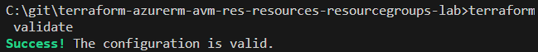

### Create Sample Code

The code is now ready to deploy the resource group.  Let’s create some sample code to call our module.

*	Open examples\default\main.tf
*	Set the enable_telementry “default” flag on line 13 to false.  We will not be sending telemetry in the lab.

```
default     = false
```

*	Comment lines 28 to 31.  Usually, you would leave the resource group in, but since we are creating a resource AVM for resource groups, the code is not needed.

```
#resource "azurerm_resource_group" "this" {
#  name     = module.naming.resource_group.name_unique
#  location = "MYLOCATION"
#}
```

*	Update lines 34 to 39 to call your module.  Notice that we will use a naming module to give a unique name to the resource group.

```
# This is the module call
module "terraform-azurerm-avm-res-resources-resourcegroups" { 
  source = "../../"
  enable_telemetry = var.enable_telemetry 
  name = module.naming.resource_group.name_unique
  location = "eastus"
}
```
* Add outputs to see the resource group name and id to the bottom of the file.  Note that they are outputting the outputs from our module.
```
output "resource_group_name" {
  value = module.terraform-azurerm-avm-res-resources-resourcegroups.resource_group_name
}

output "resource_group_id" {
  value = module.terraform-azurerm-avm-res-resources-resourcegroups.resource
}
```

Deploy the Resource Group AVM

*	The sample code also needs to be initialized and deployed
```
cd examples\default
terraform init
```

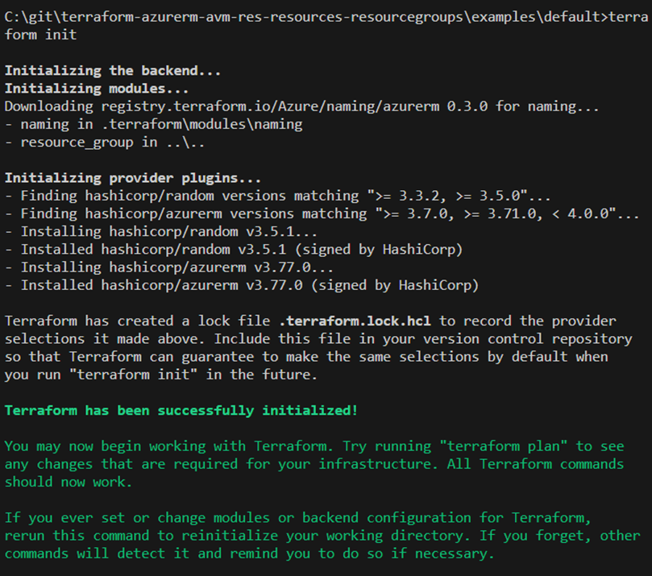

* Call Terraform plan and apply.  Enter “yes” when prompted.  The “+” sign shows resources to be added.  Note Terraform will make these changes: “3 to add, 0 to change, 0 to destroy”.

```
terraform plan
```

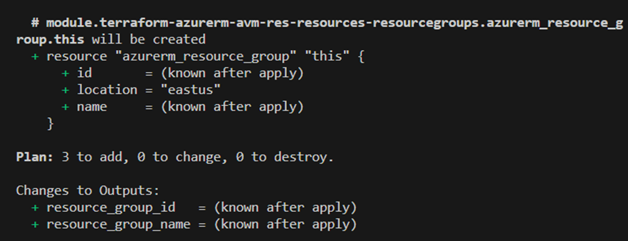

*	Deploy the resource group.  Enter “yes” when prompted.  Note that 3 resources were created.  Terraform also outputs the resource group name and id.  

```
terraform apply
```

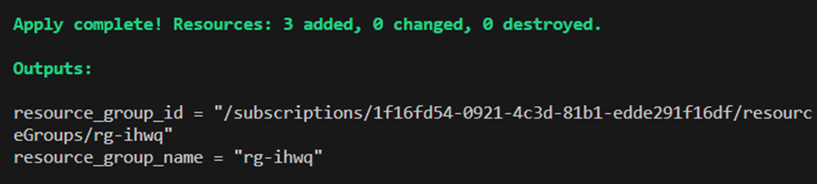

* Enter the following from the command line to see your resource group:

```
az group list -o table
```

### Add Locking and Tags variables

*	Add the following variable to your module’s variables.tf

```
variable "tags" {
  type        = map(any)
  description = "Map of tags to assign to the resources."
  default     = null
}

variable "lock" {
  type = object({
    name = optional(string, null)
    kind = optional(string, "None")
  })
  description = "The lock level to apply to the resources in this pattern. Default is `None`. Possible values are `None`, `CanNotDelete`, and `ReadOnly`."
  default     = {}
  nullable    = false
  validation {
    condition     = contains(["CanNotDelete", "ReadOnly", "None"], var.lock.kind)
    error_message = "The lock level must be one of: 'None', 'CanNotDelete', or 'ReadOnly'."
  }
}
```

* Update your module’s main.tf to add locking as follows.  Note that we added tags to the resource group.

```
resource "azurerm_resource_group" "this" {
    name     = var.name
    location = var.location
    tags     = var. tags 
}

resource "azurerm_management_lock" "this" {
  count      = var.lock.kind != "None" ? 1 : 0
  name       = coalesce(var.lock.name, "lock-${var.name}")
  scope      = azurerm_resource_group.this.id
  lock_level = var.lock.kind
}
```

* Update your example’s main.tf module call to add tags.  Hit <cntrl><space> to have intellisense show possible variable names.

```
module "terraform-azurerm-avm-res-resources-resourcegroups" { 
  source = "../../"
  enable_telemetry = var.enable_telemetry 
  name = module.naming.resource_group.name_unique
  location = "eastus"
  tags = {
    environment = "dev"
    costcenter  = "it"
  }
}
```

* Plan and apply.  Ensure you are in the examples\default directory.  Enter “yes” when prompted in the apply.

```
terraform plan
```
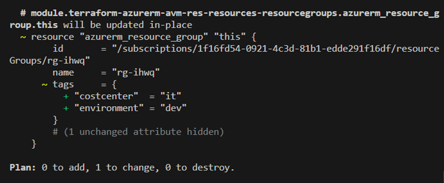

```
terraform apply
```
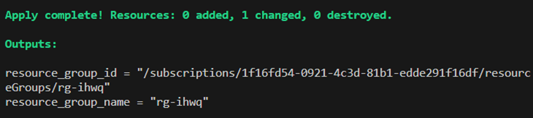

* View the tags

```
az tag list --resource-id <resource-group-id>
```

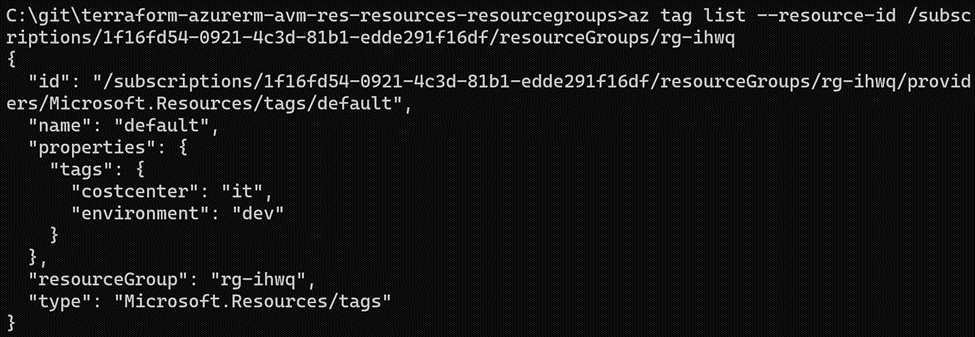

### Generating documentation

#### References

* [ID: TFNFR2 - Category: Documentation - Module Documentation Generation](https://azure.github.io/Azure-Verified-Modules/specs/terraform/#id-tfnfr2---category-documentation---module-documentation-generation)

#### Steps

* Change back to the root directory
```
cd ..\..
```
* If you have “make” installed in wsl you can run the following:
```
make docs
```
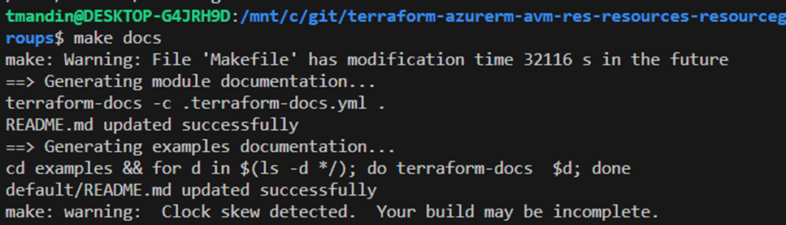

* If make is not installed, you can call terraform-docs directly:

```
terraform-docs -c .terraform-docs.yml .
```
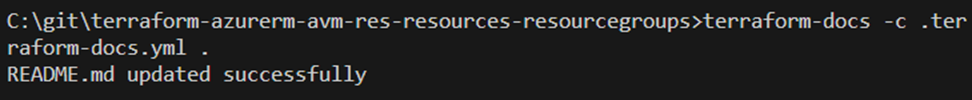

* Look at the README.md file to see that it has been updated.

### Homework: BONUS POINTS!

Looks like you finished early.  WELL DONE!! 

Here are some additional items you can try:

* Enable Locking 
  * Update the main.tf in the example app to enable locking.
  * Call “terraform apply”
  * Verify that a lock has been applied to the resource group.
* Disable Locking
  * Update the main.tf in the example app to remove locking
  *	Call “terraform apply”
  *	Verify that the lock has been removed.
* Resource groups also have a “managed by” property.  Add this variable and configure it from the example code.
  * Hint: azurerm_resource_group | Resources | hashicorp/azurerm | Terraform | Terraform Registry
* If a resource supports role assignments, they are a required interface for an AVM.  Try adding role assignments to your AVM. 
  * See Interfaces | Azure Verified Modules | Role Assignments.

### Clean Up

Remove all components created by this lab.  Enter “yes” to the prompt.

```
terraform destroy
```
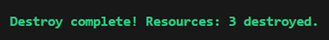